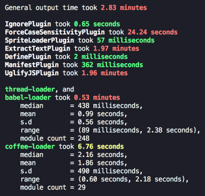

<div align="center">
  
  <h1>
    Speed Measure Plugin
    <div><sup><em>(for webpack)</em></sup></div>
  </h1>

<!-- ALL-CONTRIBUTORS-BADGE:START - Do not remove or modify this section -->
<a href="https://travis-ci.org/stephencookdev/speed-measure-webpack-plugin"></a> <a href="https://npmjs.com/package/speed-measure-webpack-plugin"></a> <a href="https://npmjs.com/package/speed-measure-webpack-plugin"></a> <a href="https://github.com/prettier/prettier"></a> <a href="#contributors"></a>
<!-- ALL-CONTRIBUTORS-BADGE:END -->

</div>
<br>

The first step to optimising your webpack build speed, is to know where to focus your attention.

This plugin measures your webpack build speed, giving an output like this:



## Install

```bash
npm install --save-dev speed-measure-webpack-plugin
```

or

```bash
yarn add -D speed-measure-webpack-plugin
```

## Requirements

SMP requires at least **Node v6**. But otherwise, accepts **all webpack** versions (1, 2, 3, and 4).

## Usage

Change your webpack config from

```javascript
const webpackConfig = {
  plugins: [new MyPlugin(), new MyOtherPlugin()],
};
```

to

```javascript
const SpeedMeasurePlugin = require("speed-measure-webpack-plugin");

const smp = new SpeedMeasurePlugin();

const webpackConfig = smp.wrap({
  plugins: [new MyPlugin(), new MyOtherPlugin()],
});
```

and you're done! SMP will now be printing timing output to the console by default.

Check out the [examples folder](/examples) for some more examples.

## Options

Pass these into the constructor, as an object:

```javascript
const smp = new SpeedMeasurePlugin(options);
```

### `options.disable`

Type: `Boolean`<br>
Default: `false`

If truthy, this plugin does nothing at all.

`{ disable: !process.env.MEASURE }` allows opt-in measurements with `MEASURE=true npm run build`.

### `options.outputFormat`

Type: `String|Function`<br>
Default: `"human"`

Determines in what format this plugin prints its measurements

- `"json"` - produces a JSON blob
- `"human"` - produces a human readable output
- `"humanVerbose"` - produces a more verbose version of the human readable output
- If a function, it will call the function with the JSON blob, and output the response

### `options.outputTarget`

Type: `String|Function`<br>
Default: `console.log`

- If a string, it specifies the path to a file to output to.
- If a function, it will call the function with the output as the first parameter

### `options.pluginNames`

Type: `Object`<br>
Default: `{}`

By default, SMP derives plugin names through `plugin.constructor.name`. For some
plugins this doesn't work (or you may want to override this default). This option
takes an object of `pluginName: PluginConstructor`, e.g.

```javascript
const uglify = new UglifyJSPlugin();
const smp = new SpeedMeasurePlugin({
  pluginNames: {
    customUglifyName: uglify,
  },
});

const webpackConfig = smp.wrap({
  plugins: [uglify],
});
```

### `options.loaderTopFiles`

Type: `Number`<br>
Default: `0`

You can configure SMP to include the files that take the most time per loader, when using `outputFormat: 'humanVerbose'`. E.g., to show the top 10 files per loader:

```javascript
const smp = new SpeedMeasurePlugin({
  outputFormat: "humanVerbose",
  loaderTopFiles: 10,
});
```

### `options.granularLoaderData` _(experimental)_

Type: `Boolean`<br>
Default: `false`

By default, SMP measures loaders in groups. If truthy, this plugin will give per-loader timing information.

This flag is _experimental_. Some loaders will have inaccurate results:

- loaders using separate processes (e.g. `thread-loader`)
- loaders emitting file output (e.g. `file-loader`)

We will find solutions to these issues before removing the _(experimental)_ flag on this option.

## FAQ

### What does general output time mean?

This tends to be down to webpack reading in from the file-system, but in general it's anything outside of what SMP can actually measure.

### What does modules without loaders mean?

It means vanilla JS files, which webpack can handle out of the box.

## Contributing

Contributors are welcome! 😊

Please check out the [CONTRIBUTING.md](./CONTRIBUTING.md).

## Migrating

SMP follows [semver](https://semver.org/). If upgrading a major version, you can consult [the migration guide](./migration.md).

## License

[MIT](/LICENSE)

## Contributors ✨

Thanks goes to these wonderful people ([emoji key](https://allcontributors.org/docs/en/emoji-key)):

<!-- ALL-CONTRIBUTORS-LIST:START - Do not remove or modify this section -->
<!-- prettier-ignore-start -->
<!-- markdownlint-disable -->
<table>
  <tr>
    <td align="center"><a href="https://stephencookdev.co.uk/"><br /><sub><b>Stephen Cook</b></sub></a><br /><a href="https://github.com/stephencookdev/speed-measure-webpack-plugin/commits?author=stephencookdev" title="Code">💻</a> <a href="https://github.com/stephencookdev/speed-measure-webpack-plugin/commits?author=stephencookdev" title="Documentation">📖</a> <a href="#blog-stephencookdev" title="Blogposts">📝</a> <a href="#design-stephencookdev" title="Design">🎨</a> <a href="#question-stephencookdev" title="Answering Questions">💬</a> <a href="https://github.com/stephencookdev/speed-measure-webpack-plugin/pulls?q=is%3Apr+reviewed-by%3Astephencookdev" title="Reviewed Pull Requests">👀</a></td>
    <td align="center"><a href="https://scarletsky.github.io/"><br /><sub><b>scarletsky</b></sub></a><br /><a href="https://github.com/stephencookdev/speed-measure-webpack-plugin/commits?author=scarletsky" title="Code">💻</a></td>
    <td align="center"><a href="https://github.com/wayou"><br /><sub><b>牛さん</b></sub></a><br /><a href="https://github.com/stephencookdev/speed-measure-webpack-plugin/commits?author=wayou" title="Code">💻</a> <a href="https://github.com/stephencookdev/speed-measure-webpack-plugin/issues?q=author%3Awayou" title="Bug reports">🐛</a></td>
    <td align="center"><a href="https://github.com/ThomasHarper"><br /><sub><b>Thomas Bentkowski</b></sub></a><br /><a href="https://github.com/stephencookdev/speed-measure-webpack-plugin/commits?author=ThomasHarper" title="Documentation">📖</a></td>
    <td align="center"><a href="https://github.com/alan-agius4"><br /><sub><b>Alan Agius</b></sub></a><br /><a href="https://github.com/stephencookdev/speed-measure-webpack-plugin/commits?author=alan-agius4" title="Code">💻</a> <a href="https://github.com/stephencookdev/speed-measure-webpack-plugin/issues?q=author%3Aalan-agius4" title="Bug reports">🐛</a></td>
    <td align="center"><a href="https://daix.me/"><br /><sub><b>Ximing</b></sub></a><br /><a href="https://github.com/stephencookdev/speed-measure-webpack-plugin/commits?author=NdYAG" title="Code">💻</a> <a href="https://github.com/stephencookdev/speed-measure-webpack-plugin/issues?q=author%3ANdYAG" title="Bug reports">🐛</a></td>
    <td align="center"><a href="https://twitter.com/lihautan"><br /><sub><b>Tan Li Hau</b></sub></a><br /><a href="https://github.com/stephencookdev/speed-measure-webpack-plugin/commits?author=tanhauhau" title="Code">💻</a> <a href="https://github.com/stephencookdev/speed-measure-webpack-plugin/issues?q=author%3Atanhauhau" title="Bug reports">🐛</a> <a href="https://github.com/stephencookdev/speed-measure-webpack-plugin/commits?author=tanhauhau" title="Tests">⚠️</a></td>
  </tr>
  <tr>
    <td align="center"><a href="https://github.com/ZauberNerd"><br /><sub><b>Björn Brauer</b></sub></a><br /><a href="https://github.com/stephencookdev/speed-measure-webpack-plugin/commits?author=ZauberNerd" title="Code">💻</a> <a href="https://github.com/stephencookdev/speed-measure-webpack-plugin/issues?q=author%3AZauberNerd" title="Bug reports">🐛</a></td>
  </tr>
</table>

<!-- markdownlint-restore -->
<!-- prettier-ignore-end -->

<!-- ALL-CONTRIBUTORS-LIST:END -->

This project follows the [all-contributors](https://github.com/all-contributors/all-contributors) specification. Contributions of any kind welcome!